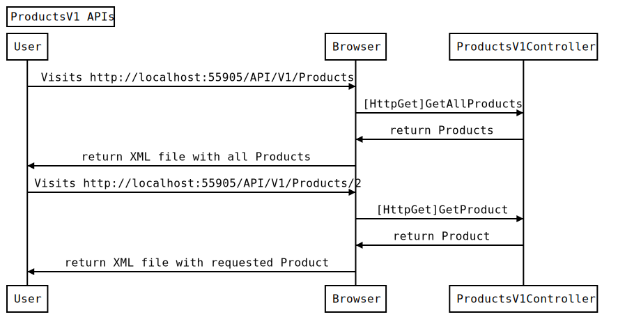
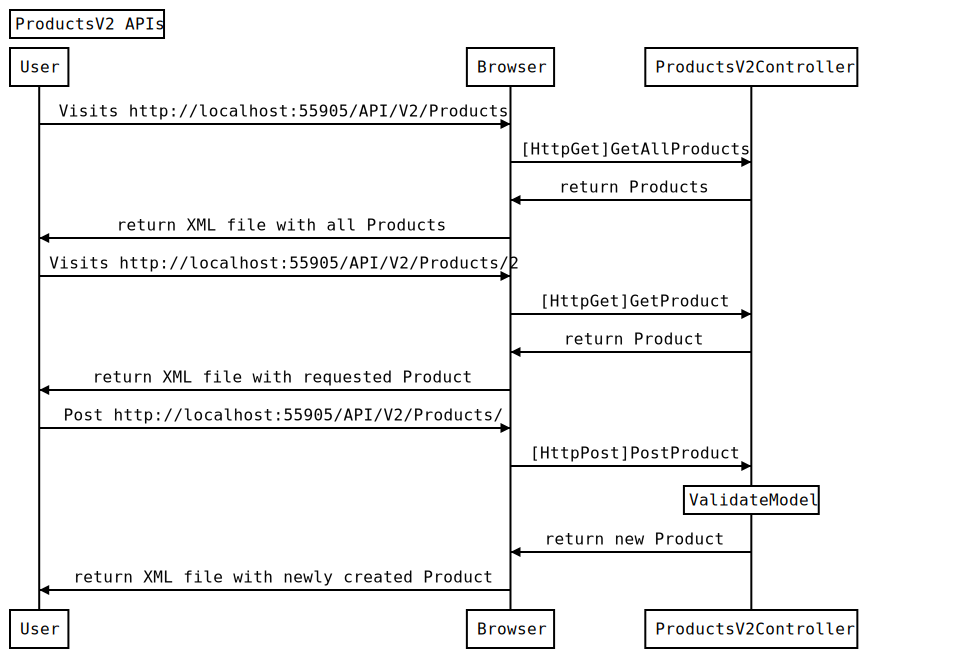
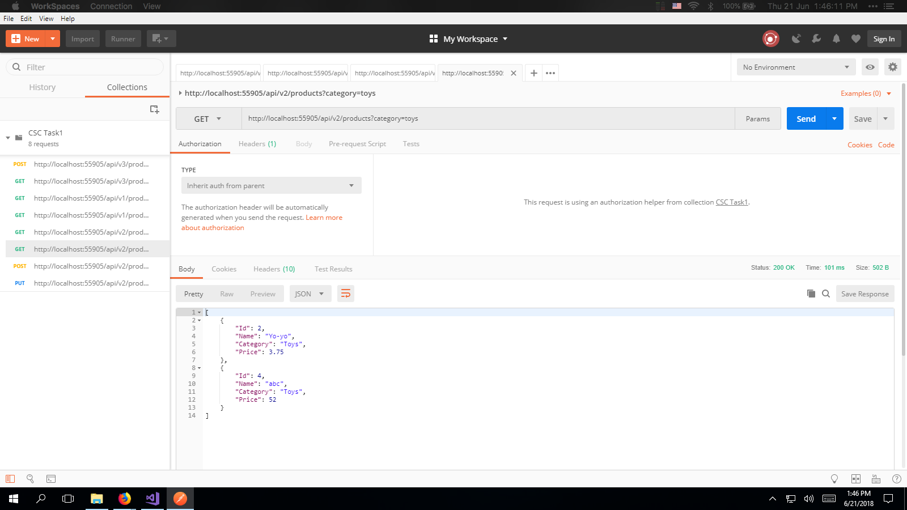

### [Navigation](readme.md)

HTML version available [here](https://francisyzy.github.io/CSCAssignment)

- [Task 1](Task1.md#task-1)
- [Task 2](Task2.md#task-2)
- [Task 3](Task3.md#task-3)
- [Task 4](Task4.md#task-4)
- [Task 5](Task5.md#task-5)

# Task 1 

This task is to enable simple CRUD operations on a web server.

The testing documentation has links that section of code that was tested.

## Requirements

[Practical 2 Part 2](https://docs.google.com/document/d/1fQCyw4GJJcSDXCAzRe9RRso-ldYJ3Ygay3UMnpahQM0/edit#bookmark=id.uu2kbbog5u9d)
Enable CRUD operations in ASP.NET Web API

[Practical 3 Part 1](https://docs.google.com/document/d/1a-Q5qkz5xAfHDKnN15zJPM69xpfsH-x7bWPAQid-m7U/edit#heading=h.i10i9kig19vg)
Validate WEB API Input using Annotation

## Code

The code for Task 1 can be found in this [branch](https://github.com/francisyzy/CSCAssignment/tree/Task1)

### Dependencies Used

#### Microsoft.AspNet.WebApi.Cors

This package enables Cross-Origin Resource Sharing (CORS) in ASP.NET Web API

[Nuget package manager](https://www.nuget.org/packages/Microsoft.AspNet.WebApi.Cors)
``` Install-Package Microsoft.AspNet.WebApi.Cors ```

## Sequence Diagram

### V1 APIs



Code to generate sequence diagram using [js-sequence-diagrams](https://bramp.github.io/js-sequence-diagrams/)
```Sequence
Title: ProductsV1 APIs
User->Browser: Visits http://localhost:55905/API/V1/Products
Browser->ProductsV1Controller: [HttpGet]GetAllProducts
ProductsV1Controller->Browser: return Products
Browser->User: return XML file with all Products
User->Browser: Visits http://localhost:55905/API/V1/Products/2
Browser->ProductsV1Controller: [HttpGet]GetProduct
ProductsV1Controller->Browser: return Product
Browser->User: return XML file with requested Product
```

### V2 APIs



Code to generate sequence diagram using [js-sequence-diagrams](https://bramp.github.io/js-sequence-diagrams/)
```Sequence
Title: ProductsV2 APIs
User->Browser: Visits http://localhost:55905/API/V2/Products
Browser->ProductsV2Controller: [HttpGet]GetAllProducts
ProductsV2Controller->Browser: return Products
Browser->User: return XML file with all Products
User->Browser: Visits http://localhost:55905/API/V2/Products/2
Browser->ProductsV2Controller: [HttpGet]GetProduct
ProductsV2Controller->Browser: return Product
Browser->User: return XML file with requested Product
User->Browser: Post http://localhost:55905/API/V2/Products/
Browser->ProductsV2Controller: [HttpPost]PostProduct
Note over ProductsV2Controller: ValidateModel
ProductsV2Controller->Browser: return new Product
Browser->User: return XML file with newly created Product
```

## Testing

### V1 APIs

#### Web

*[Link to code](https://github.com/francisyzy/CSCAssignment/blob/Task1/CSCAssignment/index.html)*


#### Get

*[Link to code](https://github.com/francisyzy/CSCAssignment/blob/Task1/CSCAssignment/Controllers/ProductsV1Controller.cs#L57-L63)*


#### Get by id

*[Link to code](https://github.com/francisyzy/CSCAssignment/blob/Task1/CSCAssignment/Controllers/ProductsV1Controller.cs#L66-L77)*


---

### V2 APIs

#### Get

*[Link to code](https://github.com/francisyzy/CSCAssignment/blob/Task1/CSCAssignment/Controllers/ProductsV2Controller.cs#L15-L21)*


#### Get by id

*[Link to code](https://github.com/francisyzy/CSCAssignment/blob/Task1/CSCAssignment/Controllers/ProductsV2Controller.cs#L22-L39)*


#### Get by category

*[Link to code](https://github.com/francisyzy/CSCAssignment/blob/Task1/CSCAssignment/Controllers/ProductsV2Controller.cs#L40-L47)*



#### Post

*[Link to code](https://github.com/francisyzy/CSCAssignment/blob/Task1/CSCAssignment/Controllers/ProductsV2Controller.cs#L48-L66)*


#### Put

*[Link to code](https://github.com/francisyzy/CSCAssignment/blob/Task1/CSCAssignment/Controllers/ProductsV2Controller.cs#L67-L84)*


#### Delete

*[Link to code](https://github.com/francisyzy/CSCAssignment/blob/Task1/CSCAssignment/Controllers/ProductsV2Controller.cs#L85-L102)*


---

### V3 APIs

[Difference between V2 and V3 controller](https://www.diffchecker.com/ZfFoaugN)

#### Get

*[Link to code](https://github.com/francisyzy/CSCAssignment/blob/Task1/CSCAssignment/Controllers/ProductsV3Controller.cs#L17-L23)*


#### Post

*[Link to code](https://github.com/francisyzy/CSCAssignment/blob/Task1/CSCAssignment/Controllers/ProductsV3Controller.cs#L66-L85)*


//Did not screenshot the test conducted on the other crud operations but they should be similar to V2 due to similar implementations but with different return messages.

---
©2018 [francisyzy](http://francisyzy.github.io) - [Github](https://github.com/francisyzy)