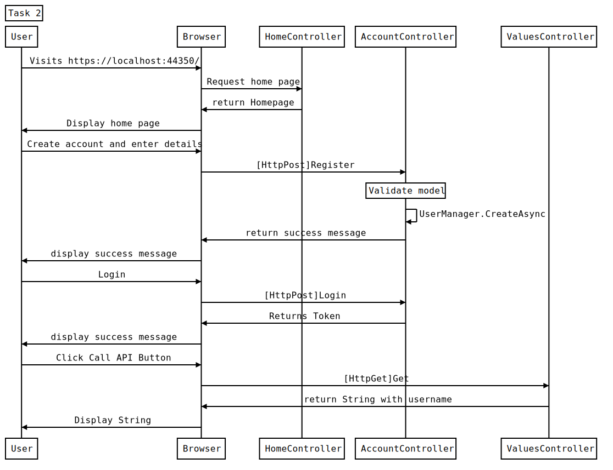

### [Navigation](readme.md)

HTML version available [here](https://francisyzy.github.io/CSCAssignment)

- [Task 1](task1.md#task-1)
- [Task 2](task2.md#task-2)
- [Task 3](task3.md#task-3)
- [Task 4](task4.md#task-4)
- [Task 5](task5.md#task-5)

# Task 2 

This task is to enable authentication and authorization of web apis.

The testing documentation has links that section of code that was tested.

## Requirements

Web Api 2 Security Authentication and Authorization using Bearer Token. [Tutorial Link](mycsc.net/uncategorized/web-api-2-security-authentication-bearer-token-tutorial/)

## Code

The code for Task 2 can be found in this [branch](https://github.com/francisyzy/CSCAssignment/tree/Task2)

### Dependencies Used

#### Knockout.js

A JavaScript MVVM library to help you create rich, dynamic user interfaces with clean maintainable code

[Nuget package manager](https://www.nuget.org/packages/knockoutjs)
``` Install-Package knockoutjs ```

## Sequence Diagram



Code to generate sequence diagram using [js-sequence-diagrams](https://bramp.github.io/js-sequence-diagrams/)
```Sequence
Title: Task 2
User->Browser: Visits https://localhost:44350/
Browser->HomeController: Request home page
HomeController->Browser: return Homepage
Browser->User: Display home page
User->Browser: Create account and enter details
Browser->AccountController: [HttpPost]Register
Note over AccountController: Validate model
AccountController->AccountController: UserManager.CreateAsync
AccountController->Browser: return success message
Browser->User: display success message
User->Browser: Login
Browser->AccountController: [HttpPost]Login
AccountController->Browser: Returns Token
Browser->User: display success message
User->Browser: Click Call API Button
Browser->ValuesController: [HttpGet]Get
ValuesController->Browser: return String with username
Browser->User: Display String
```

## Testing

### Not authorized

*[Link to code](https://github.com/francisyzy/CSCAssignment/blob/Task2/CSCAssignment/Controllers/ValuesController.cs#L13-L19)*

#### Web


#### Postman


### Create account

*[Link to code](https://github.com/francisyzy/CSCAssignment/blob/Task2/CSCAssignment/Controllers/AccountController.cs#L321-L341)*


### Login

*[Link to code](https://github.com/francisyzy/CSCAssignment/blob/Task2/CSCAssignment/Controllers/AccountController.cs#L156-L192)*


### Get bearer token

Press ```f12``` on the keyboard to open developer tools and get the bearer token from the response of login.


### Use bearer token in Postman

Use the access/bearer token retrieved from the browser for use in postman.


### SQL Query to see users

*[Link to code](https://github.com/francisyzy/CSCAssignment/blob/Task2/SQLQuery1.sql)*


---
©2018 [francisyzy](http://francisyzy.github.io) - [Github](https://github.com/francisyzy)