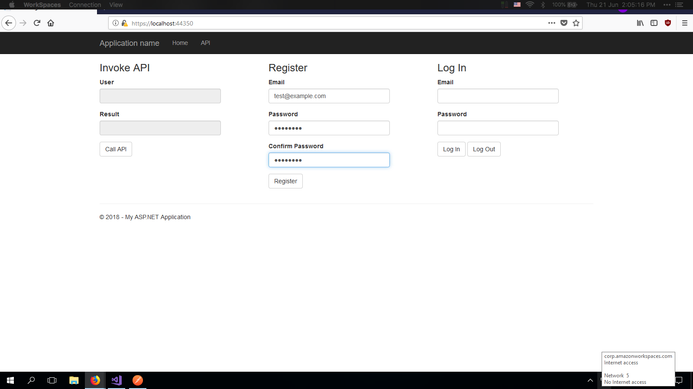
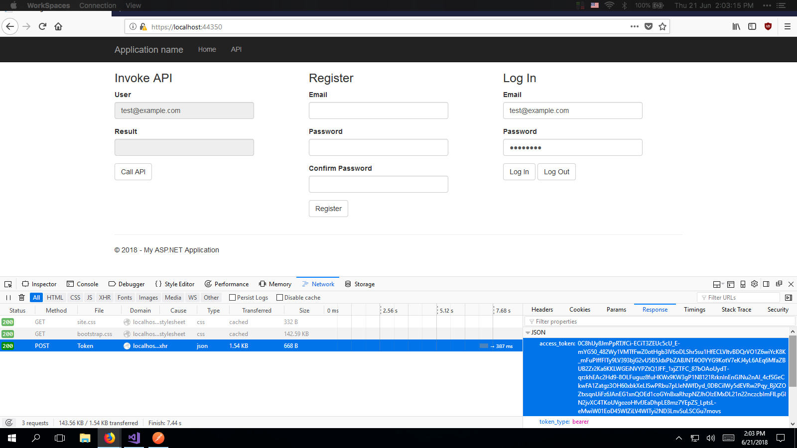

# Task 2 

This task is to enable authentication and authorization of web apis.

The testing documentation has links that section of code that was tested.

## Requirements

Web Api 2 Security Authentication and Authorization using Bearer Token. [Tutorial Link](mycsc.net/uncategorized/web-api-2-security-authentication-bearer-token-tutorial/)

## Code

The code for Task 2 can be found in this [branch](https://github.com/francisyzy/CSCAssignment/tree/Task2)

### Dependencies Used

#### Knockout.js

A JavaScript MVVM library to help you create rich, dynamic user interfaces with clean maintainable code

[Nuget package manager](https://www.nuget.org/packages/knockoutjs)
``` Install-Package knockoutjs ```

## Testing

### Not authorized

*[Link to code](https://github.com/francisyzy/CSCAssignment/blob/Task2/CSCAssignment/Controllers/ValuesController.cs#L13-L19)*

#### Web


#### Postman


### Create account

*[Link to code](https://github.com/francisyzy/CSCAssignment/blob/Task2/CSCAssignment/Controllers/AccountController.cs#L321-L341)*



### Login

*[Link to code](https://github.com/francisyzy/CSCAssignment/blob/Task2/CSCAssignment/Controllers/AccountController.cs#L156-L192)*


### Get bearer token

Press ```f12``` on the keyboard to open developer tools and get the bearer token from the response of login.



### Use bearer token in Postman

Use the access/bearer token retrieved from the browser for use in postman.


### SQL Query to see users

*[Link to code](https://github.com/francisyzy/CSCAssignment/blob/Task2/SQLQuery1.sql)*


