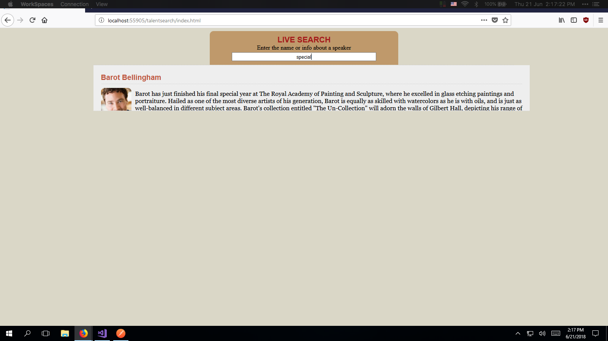

# Task 3

Implement a front end to consume the back end API.

## Requirements

Implement Talent Search front end to consume back end APIs. [Tutorial Link](mycsc.net/cloud-service/restful/e-learning-week-activity/)

## Code

The code for Task 3 can be found in this [branch](https://github.com/francisyzy/CSCAssignment/tree/Task3)

### Dependencies Used

#### Microsoft.AspNet.WebApi.Cors

This package enables Cross-Origin Resource Sharing (CORS) in ASP.NET Web API

[Nuget package manager](https://www.nuget.org/packages/Microsoft.AspNet.WebApi.Cors)
``` Install-Package Microsoft.AspNet.WebApi.Cors ```

## Testing

### Front-end

*[Link to code](https://github.com/francisyzy/CSCAssignment/tree/Task3/CSCAssignment/TalentSearch)*


### Front-end test search

I have added a string called ```special``` in one of the bio text to ensure that the data comes from [TalentRepository](https://github.com/francisyzy/CSCAssignment/blob/Task3/CSCAssignment/Models/TalentRepository.cs#L19) rather than [Data.json](https://github.com/francisyzy/CSCAssignment/blob/Task3/CSCAssignment/TalentSearch/data.json#L7)

*[Link to changed section](https://github.com/francisyzy/CSCAssignment/blob/Task3/CSCAssignment/Models/TalentRepository.cs#L19)*



### Get

*[Link to code](https://github.com/francisyzy/CSCAssignment/blob/Task3/CSCAssignment/Controllers/TalentsController.cs#L18-L23)*


### Get by id

*[Link to code](https://github.com/francisyzy/CSCAssignment/blob/Task3/CSCAssignment/Controllers/TalentsController.cs#L25-L35)*


### Post

*[Link to code](https://github.com/francisyzy/CSCAssignment/blob/Task3/CSCAssignment/Controllers/TalentsController.cs#L38-L61)*


### Put

*[Link to code](https://github.com/francisyzy/CSCAssignment/blob/Task3/CSCAssignment/Controllers/TalentsController.cs#L64-L79)*


### Delete

*[Link to code](https://github.com/francisyzy/CSCAssignment/blob/Task3/CSCAssignment/Controllers/TalentsController.cs#L82-L98)*


### Image Stored in S3 Bucket

*[Link to code](https://github.com/francisyzy/CSCAssignment/blob/Task3/CSCAssignment/TalentSearch/script.js#L33)*


### Error

*[Link to code](https://github.com/francisyzy/CSCAssignment/blob/Task3/CSCAssignment/TalentSearch/script.js#L63-L64)*


---
©2018 [francisyzy](http://francisyzy.github.io) - [Github](https://github.com/francisyzy)