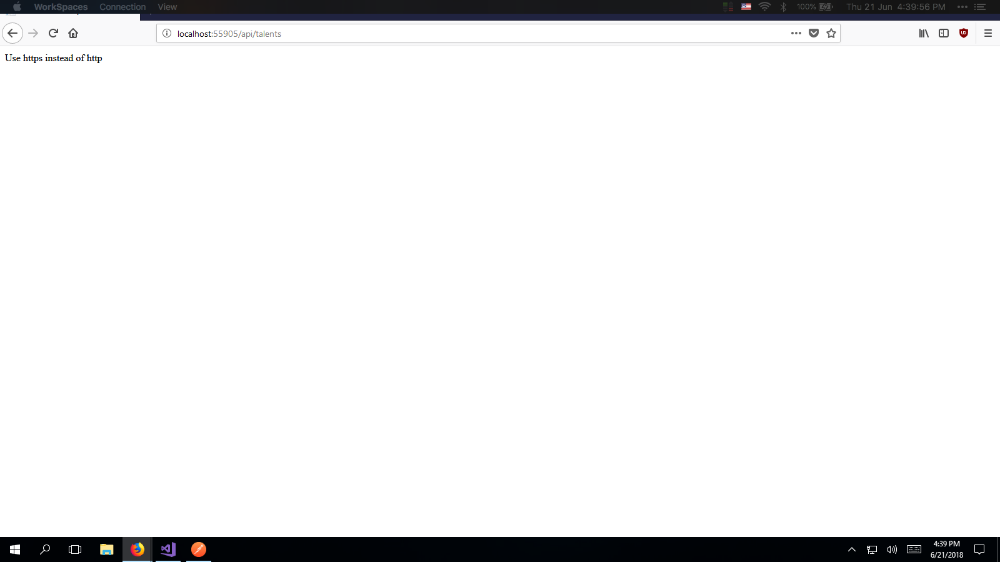
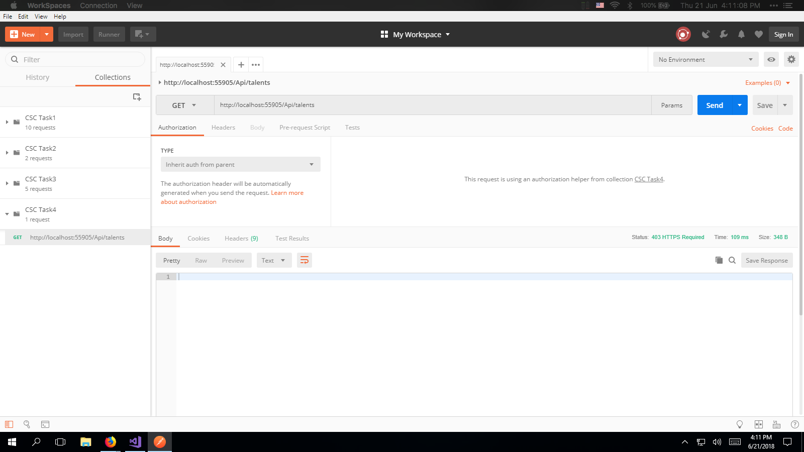
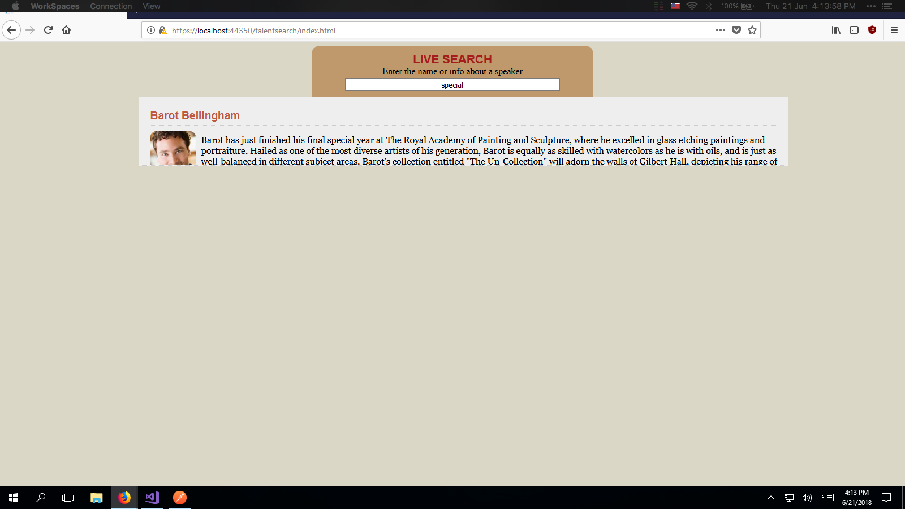
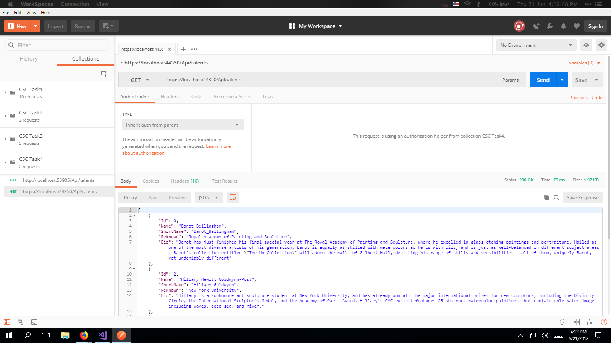

### [Navigation](readme.md)

HTML version available [here](https://francisyzy.github.io/CSCAssignment)

- [Task 1](Task1.md#task-1)
- [Task 2](Task2.md#task-2)
- [Task 3](Task3.md#task-3)
- [Task 4](Task4.md#task-4)
- [Task 5](Task5.md#task-5)

# Task 4

Add SSL and HTTPS to Task 3

## Requirements

Add security to Task 3. [Tutorial](https://www.youtube.com/watch?v=xIzlD-frEw4&t=179s)

## Code

The code for Task 4 can be found in this [branch](https://github.com/francisyzy/CSCAssignment/tree/Task4)

Data annotations are added in this [commit](https://github.com/francisyzy/CSCAssignment/commit/4ff572fca52422a1455a271cbd2bdda2b87cc534)

### Dependencies Used

#### Microsoft.AspNet.WebApi.Cors

This package enables Cross-Origin Resource Sharing (CORS) in ASP.NET Web API

[Nuget package manager](https://www.nuget.org/packages/Microsoft.AspNet.WebApi.Cors)
``` Install-Package Microsoft.AspNet.WebApi.Cors ```

## Testing

### Web without https

*[Link to code](https://github.com/francisyzy/CSCAssignment/blob/Task4/CSCAssignment/Filters/RequireHttpsAttribute.cs#L19)*



### Postman without https

*[Link to code](https://github.com/francisyzy/CSCAssignment/blob/Task4/CSCAssignment/Filters/RequireHttpsAttribute.cs)*



### Web with https

*[Link to code](https://github.com/francisyzy/CSCAssignment/blob/Task4/CSCAssignment/Controllers/TalentsController.cs#L18)*



### Postman with https

*[Link to code](https://github.com/francisyzy/CSCAssignment/blob/Task4/CSCAssignment/Controllers/TalentsController.cs#L18)*



---
©2018 [francisyzy](http://francisyzy.github.io) - [Github](https://github.com/francisyzy)