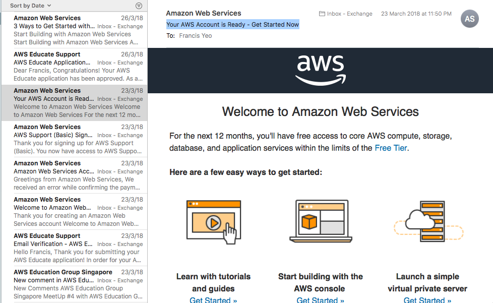
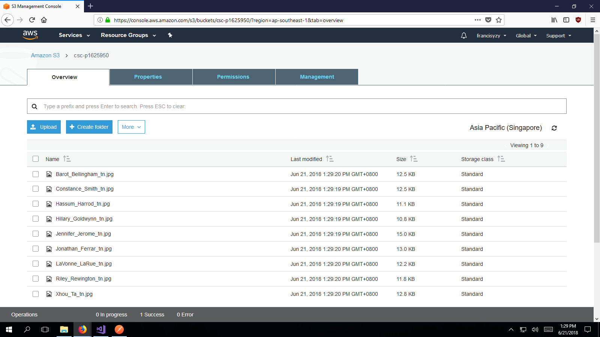
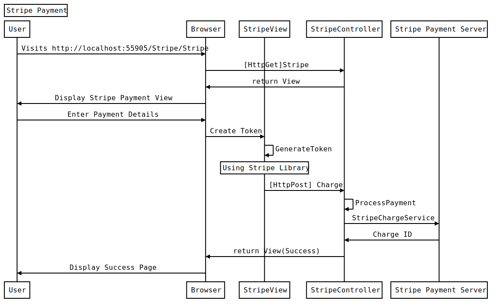
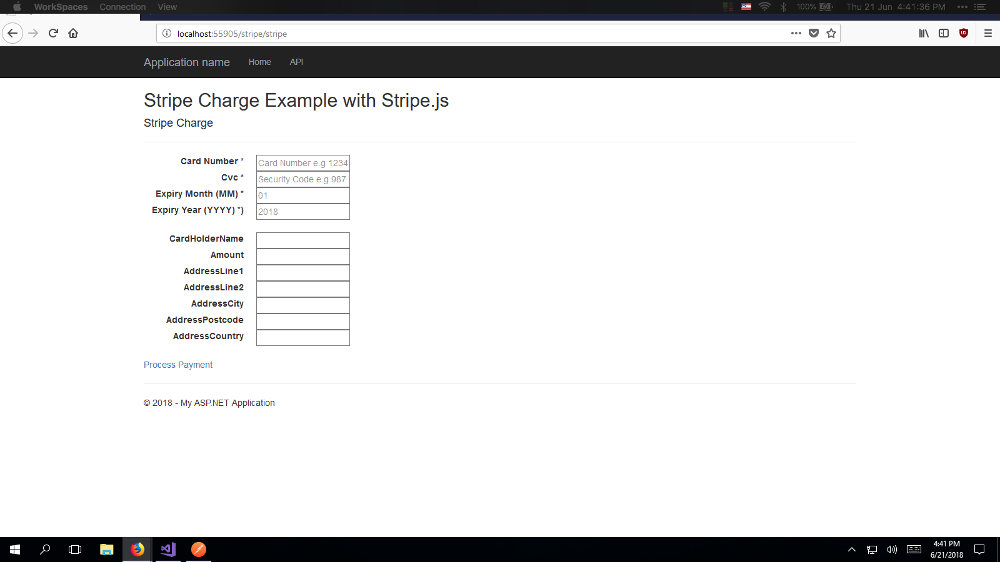
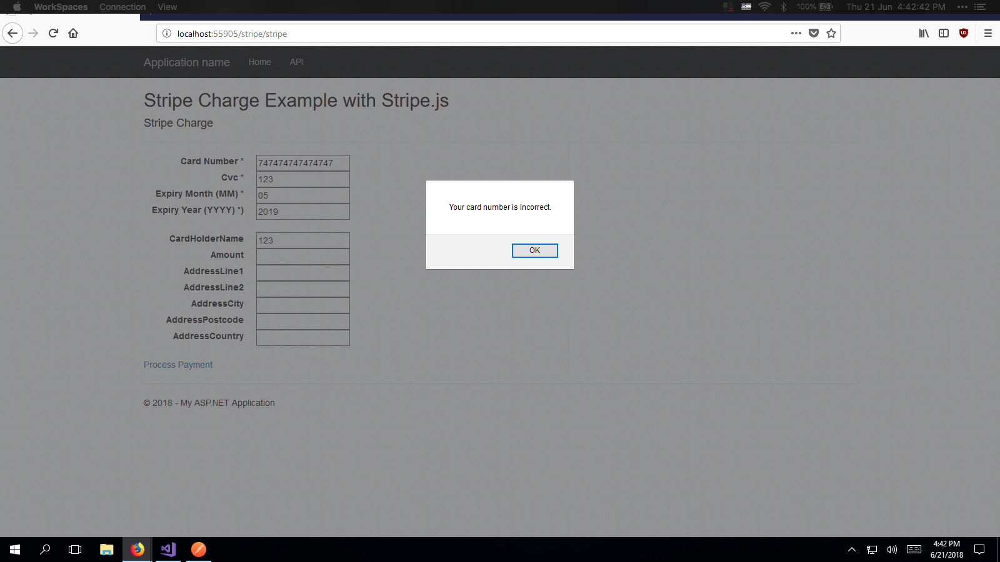
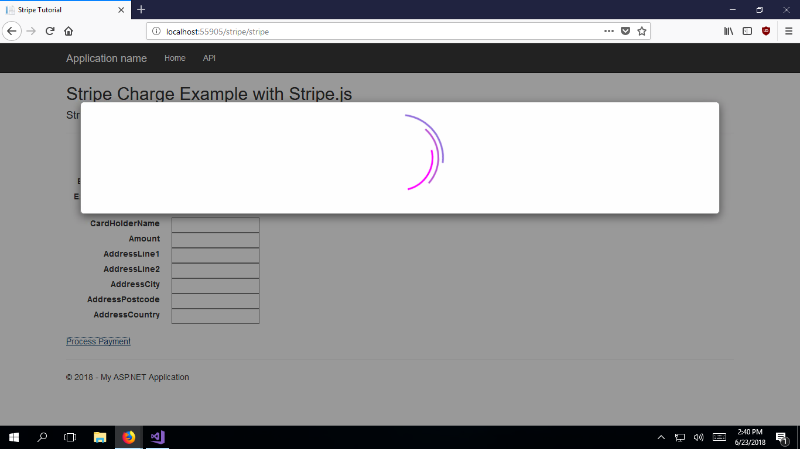

# Task 5

Implement [Stripe](http://stripe.com) payment gateway and store talent in [AWS S3](https://aws.amazon.com/s3/).

## Requirements

Add Stripe. [Tutorial](https://docs.google.com/document/d/1sBDyVmLOHkDB5cHqbnG3mzuwwv6y5QSMWhifBxKxvvI/edit)

Store talents photo in AWS S3

Get AWS Educate Account

## AWS Deliverables

### Create AWS Account



### Store talents photo in AWS S3



#### Usage in Task 3

Image links using S3 Bucket


## Code

The code for Task 5 can be found in this [branch](https://github.com/francisyzy/CSCAssignment/tree/Task5)

### Dependencies Used

#### Stripe.net

Stripe.net is a sync/async .NET 4.5+ client, and a portable class library for the Stripe API.  (Official Library)

[Nuget package manager](https://www.nuget.org/packages/Stripe.net/)
``` Install-Package Stripe.net ```

## Sequence Diagram

### Stripe API



Code to generate sequence diagram using [js-sequence-diagrams](https://bramp.github.io/js-sequence-diagrams/)

```Sequence
Title: Stripe Payment
participant User
participant Browser
participant StripeView
participant StripeController
User->Browser: Visits http://localhost:55905/Stripe/Stripe
Browser->StripeController: [HttpGet]Stripe
StripeController->Browser: return View
Browser->User: Display Stripe Payment View
User->Browser: Enter Payment Details
Browser->StripeView: Create Token
StripeView->StripeView: GenerateToken
Note over StripeView: Using Stripe Library
StripeView->StripeController: [HttpPost] Charge
StripeController->StripeController: ProcessPayment
StripeController->Stripe Payment Server: StripeChargeService
Stripe Payment Server->StripeController: Charge ID
StripeController->Browser: return View(Success)
Browser->User: Display Success Page
```

## Testing

### Stripe

*[Link to code](https://github.com/francisyzy/CSCAssignment/commit/30156bd9b437c364a2576bdf11edd5533ce840a2)*



### Stripe validation

*[Link to code](https://github.com/francisyzy/CSCAssignment/blob/Task5/CSCAssignment/Views/Stripe/Stripe.cshtml#L249-L281)*



### Stripe loading gif

*[Link to code](https://github.com/francisyzy/CSCAssignment/blob/Task5/CSCAssignment/Views/Stripe/Stripe.cshtml#L13-L114)*



---
©2018 [francisyzy](http://francisyzy.github.io) - [Github](https://github.com/francisyzy)